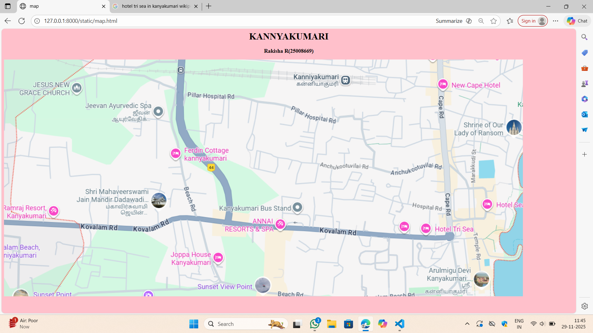
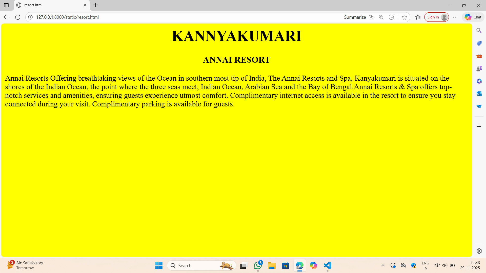
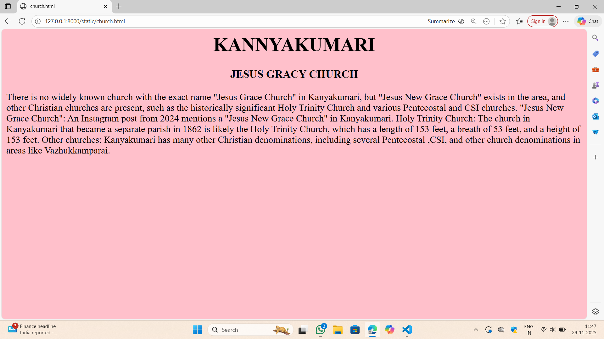
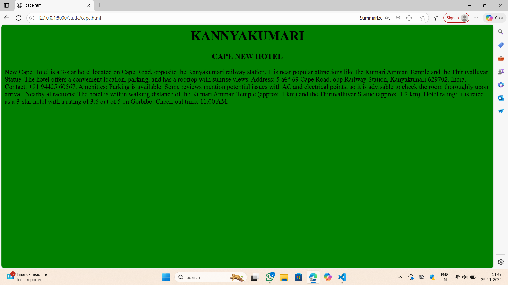
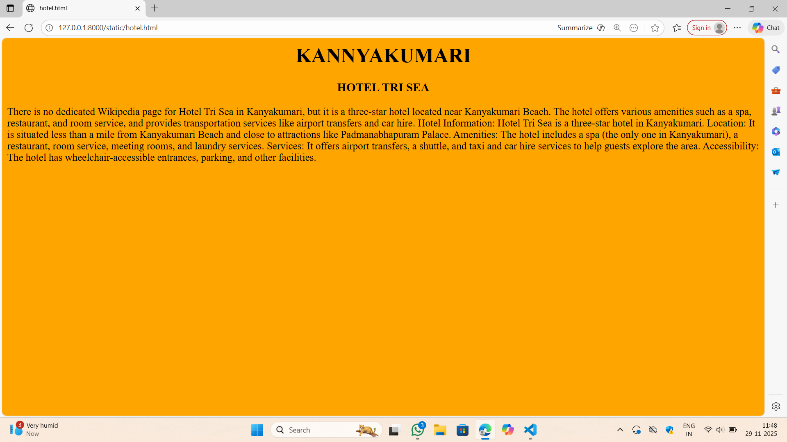

# Ex03 Places Around Me
## Date: 29-11-2025

## AIM
To develop a website to display details about the places around my house.

## DESIGN STEPS

### STEP 1
Create a Django admin interface.

### STEP 2
Download your city map from Google as an image.

### STEP 3
Insert the image using `````` tag and link it to the map.

### STEP 4
Using ```<map>``` tag name the map.

### STEP 5
Create clickable regions in the image using ```<area>``` tag.

### STEP 6
Write HTML programs for all the regions identified.

### STEP 7
Execute the programs and publish them.

## CODE
```
map.html
<html>
    <head>
        <title>map</title>
    </head>
    <body bgcolor="pink">
        <h1 align="center">KANNYAKUMARI</h1>
        <h3 align="center">Rakisha R(25008669) </h3>
    
            
              

        <map name="image-map">
            <area target="" alt="annai resorts" title="annai resorts" href="resort.html" coords="744,538,986,618" shape="rect">
            <area target="" alt="ferdin cottage" title="ferdin cottage" href="ferdin.html" coords="699,333,128" shape="circle">
            <area target="" alt="jesus new church" title="jesus new church" href="church.html" coords="177,25,272,96,269,178,71,188,55,69" shape="poly">
            <area target="" alt="new cape hotel" title="new cape hotel" href="cape.html" coords="1445,36,1720,120" shape="rect">
            <area target="" alt="hotel tri sea" title="hotel tri sea" href="hotel.html" coords="1551,579,96" shape="circle">

        </map>
    </body>
</html>

resort.html
<html>
    <head>
        <title>resort.html</title>
    </head>
    <body bgcolor="yellow">
        <h1 align="center"> KANNYAKUMARI</h1>
        <h3 align="center"> ANNAI RESORT</h3>
        <p>Annai Resorts Offering breathtaking views of the Ocean in southern most 
           tip of India, The Annai Resorts and Spa, Kanyakumari is situated on the shores of the Indian Ocean,
           the point where the three seas meet, Indian Ocean, Arabian Sea and the Bay of Bengal.Annai Resorts & 
           Spa offers top-notch services and amenities, ensuring guests experience utmost comfort. Complimentary
           internet access is available in the resort to ensure you stay connected during your visit. Complimentary
           parking is available for guests.
        </p>
   </body>

</html>

ferdin.html
<html>
    <head>
        <title>ferdin.html</title>
    </head>
    <body bgcolor="light blue">
        <h1 align="center"> KANNYAKUMARI</h1>
        <h3 align="center">FERDIN COTTAGE</h3>
        <p>"FERDIN COTTAGE" in Kanyakumari is a guest house/hotel property, 
            not a historical or cultural landmark with its own dedicated 
            Wikipedia page. Information available online is focused on its
            services, location, and guest reviews, rather than a general
            encyclopedic entry.Based on recent search results, prices
            generally range from ₹3,200 to over ₹5,200 per night, though 
            lower or higher rates may be available depending on the season,
            room type, and specific offers.  
        </p>
   </body>

</html>


church.html
<html>
    <head>
        <title>church.html</title>
    </head>
    <body bgcolor="pink">
        <h1 align="center"> KANNYAKUMARI</h1>
        <h3 align="center"> JESUS GRACY CHURCH</h3>
        <p>There is no widely known church with the exact name "Jesus Grace Church" in Kanyakumari,
            but "Jesus New Grace Church" exists in the area, and other Christian churches are present,
            such as the historically significant Holy Trinity Church and various Pentecostal and CSI churches. 
           "Jesus New Grace Church": An Instagram post from 2024 mentions a "Jesus New Grace Church" in Kanyakumari.
            Holy Trinity Church: The church in Kanyakumari that became a separate parish in 1862 is likely the Holy 
            Trinity Church, which has a length of 153 feet, a breath of 53 feet, and a height of 153 feet.
            Other churches: Kanyakumari has many other Christian denominations, including several Pentecostal
            ,CSI, and other church denominations in areas like Vazhukkamparai. 
        </p>
   </body>

</html>


cape.html
<html>
    <head>
        <title>cape.html</title>
    </head>
    <body bgcolor="green">
        <h1 align="center"> KANNYAKUMARI</h1>
        <h3 align="center">CAPE NEW HOTEL</h3>
        <p>New Cape Hotel is a 3-star hotel located on Cape Road, opposite the Kanyakumari 
            railway station. It is near popular attractions like the Kumari Amman Temple 
            and the Thiruvalluvar Statue. The hotel offers a convenient location, parking,
             and has a rooftop with sunrise views. 
           Address: 5 – 69 Cape Road, opp Railway Station, Kanyakumari 629702, India.
           Contact: +91 94425 60567.
           Amenities: Parking is available. Some reviews mention potential issues with AC and
            electrical points, so it is advisable to check the room thoroughly upon arrival.
           Nearby attractions: The hotel is within walking distance of the Kumari Amman Temple
            (approx. 1 km) and the Thiruvalluvar Statue (approx. 1.2 km).
           Hotel rating: It is rated as a 3-star hotel with a rating of 3.6 out of 5 on Goibibo.
           Check-out time: 11:00 AM. 
        </p>
   </body>

</html>


hotel.html
<html>
    <head>
        <title>hotel.html</title>
    </head>
    <body bgcolor="orange">
        <h1 align="center"> KANNYAKUMARI</h1>
        <h3 align="center"> HOTEL TRI SEA</h3>
        <p>There is no dedicated Wikipedia page for Hotel Tri Sea in Kanyakumari, but it is a three-star hotel located near Kanyakumari Beach. The hotel offers various amenities such as a spa, restaurant, and room service, and provides transportation services like airport transfers and car hire. 
           Hotel Information: Hotel Tri Sea is a three-star hotel in Kanyakumari.
           Location: It is situated less than a mile from Kanyakumari Beach and close to attractions like Padmanabhapuram Palace.
           Amenities: The hotel includes a spa (the only one in Kanyakumari), a restaurant, room service, meeting rooms, and laundry services.
           Services: It offers airport transfers, a shuttle, and taxi and car hire services to help guests explore the area.
           Accessibility: The hotel has wheelchair-accessible entrances, parking, and other facilities. 
        </p>
   </body>

</html>
```

## OUTPUT








## RESULT
The program for implementing image maps using HTML is executed successfully.
